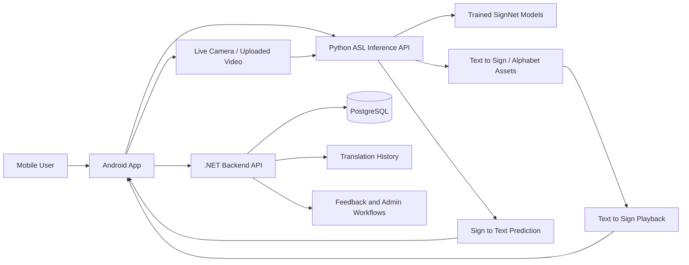

# ASL System

This repository packages the full SignAssist demo into one cloneable root with three runnable projects:

## Research Motivation

Accessible communication tools can reduce barriers for Deaf and hard-of-hearing users, but practical sign language systems need more than a model checkpoint. This project explores a full-stack multimodal ML workflow that connects sign recognition, text-to-sign playback, backend APIs, persistent history, and mobile interaction.

## Research Problem

How can a multimodal sign language recognition system combine machine learning inference, backend services, and a mobile user experience to support sign-to-text and text-to-sign workflows in a usable accessibility prototype?

## Objectives

- Provide sign-to-text prediction from live frames and uploaded video.
- Support text-to-sign playback and learning assets for alphabet/sign practice.
- Connect Python ML inference with .NET APIs, PostgreSQL storage, and Android UI.
- Preserve feedback, history, and admin flows for real user testing.
- Package the full system so it can be cloned, run, and extended for future experiments.

## Project Contribution

This project contributes a full-stack accessibility prototype rather than a standalone ML notebook. It shows how trained sign recognition models can be wrapped with APIs, mobile interaction, user history, feedback, admin workflows, and learning features to support real usability testing.

## Research Relevance

The project is relevant to multimodal ML, human-computer interaction, accessibility technology, and applied AI evaluation. It can support future experiments on model accuracy, latency, user feedback loops, mobile usability, confidence reporting, and vocabulary expansion for sign language systems.

## System Architecture

The system has three main layers: a .NET API for users, feedback, history, and admin workflows; a Python backend for trained ASL model inference and text-to-sign assets; and an Android application for user interaction. PostgreSQL stores application data while committed model checkpoints support reproducible demo behavior.

## Architecture Diagram



## Experimental Setup

- Python backend serves trained model checkpoints for live and uploaded-video inference.
- Android client exercises sign-to-text, text-to-sign, learning, feedback, and history flows.
- .NET backend provides authenticated API workflows and persistent PostgreSQL-backed data.
- Local testing uses separate backend ports for API services and mobile network configuration.

## Evaluation Results

| Evaluation area | Result |
| --- | --- |
| Model artifact readiness | Repository includes trained checkpoints `word_signnet_best.pth` and `signnet_best.pth` for demo/testing. |
| Inference workflow | Python backend exposes live frame prediction, uploaded-video sign-to-text, text-to-sign playback data, and learning assets. |
| Full-stack integration | Android app connects to both .NET user/admin APIs and Python ASL inference APIs. |
| Persistence workflow | .NET backend supports authentication, feedback, translation history, learning APIs, and admin APIs with PostgreSQL. |
| Demo reproducibility | README documents backend ports, health check, Android API configuration, and APK build flow for repeatable local testing. |

These results describe implemented prototype capabilities and demo readiness. Formal accuracy benchmarking across signer diversity, lighting, and camera conditions remains future work.

## Future Research

- Evaluate recognition accuracy across lighting, camera angles, and signer variation.
- Expand the dataset for larger vocabulary and sentence-level sign recognition.
- Compare model architectures for real-time inference on mobile-friendly hardware.
- Add confidence calibration and uncertainty display for safer user interaction.
- Study usability with accessibility-focused user testing.

## Citation

```bibtex
@software{saeed2026aslsignrecognition,
  author = {Saeed, Babar},
  title = {ASL Sign Recognition System},
  year = {2026},
  url = {https://github.com/Babar860/ASL-Sign-Recognition}
}
```

```text
ASL_System/
  ASL_backend_Api_System/        .NET backend API
  ASL_Trained_model_system/      Python ASL backend and trained models
  ASL_Mobile_Application_system/ Android mobile app frontend
```

## What is included

- User authentication, feedback, translation history, learning, and admin APIs in .NET
- Sign-to-text, live frame prediction, text-to-sign, and alphabet asset handling in Python
- Android app UI, navigation, and API integration for user and admin flows
- Trained model checkpoints required for demo/testing

## Quick start

1. Start PostgreSQL.
2. Run the .NET backend on port `5140`.
3. Run the Python backend on port `8000`.
4. Update the Android API IP address if the PC network changes.
5. Build and run the Android app on a device or emulator.

## 1. .NET backend

Folder:

```text
ASL_backend_Api_System
```

Run:

```powershell
cd ASL_backend_Api_System
dotnet restore
dotnet run --urls http://0.0.0.0:5140
```

Swagger:

```text
http://localhost:5140/swagger
```

Default database connection in `appsettings.json`:

```json
"Host=localhost;Port=5432;Database=SIGN_LANGUAGE_DATABASE;Username=postgres;Password=12345"
```

This backend provides:

- signup/login/password reset
- feedback storage
- translation history storage
- learning APIs
- admin APIs for users, feedback, and Text-to-Sign history

## 2. Python backend

Folder:

```text
ASL_Trained_model_system
```

Install:

```powershell
cd ASL_Trained_model_system
python -m venv .venv
.\.venv\Scripts\python.exe -m pip install --upgrade pip
.\.venv\Scripts\python.exe -m pip install -r requirements.txt
```

Run:

```powershell
.\.venv\Scripts\python.exe -m uvicorn api_server:app --host 0.0.0.0 --port 8000
```

Health check:

```powershell
Invoke-RestMethod http://127.0.0.1:8000/health
```

Included model files:

```text
models/word_signnet_best.pth
models/signnet_best.pth
```

This backend provides:

- live sign-to-text prediction
- sign-to-text on uploaded video
- text-to-sign playback data
- learning alphabet assets

Training scripts are included if you need to retrain later:

```powershell
.\.venv\Scripts\python.exe train.py
.\.venv\Scripts\python.exe train_words.py
```

## 3. Android app

Folder:

```text
ASL_Mobile_Application_system
```

Build APK:

```powershell
$env:JAVA_HOME='C:\Program Files\Android\Android Studio\jbr'
$env:Path="$env:JAVA_HOME\bin;$env:Path"
.\gradlew.bat :app:assembleDebug
```

APK output:

```text
app/build/outputs/apk/debug/app-debug.apk
```

Backend URLs are configured in:

```text
app/src/main/java/com/example/signassistap/network/ApiClient.kt
```

Current default values:

```kotlin
private const val BASE_URL = "http://192.168.0.33:5140/"
private const val ASL_BASE_URL = "http://192.168.0.33:8000/"
```

For Android Emulator, use:

```text
http://10.0.2.2:5140/
http://10.0.2.2:8000/
```

Main app features:

- user login and signup
- admin login from the same screen
- live sign-to-text camera flow
- text-to-sign playback with speed control
- learning alphabet section
- feedback and history
- admin dashboard

Admin login:

```text
Email: admin@gmail.com
Password: admin123
```

## Demo checklist

Before testing on another machine:

1. Clone this repo.
2. Install PostgreSQL and update the backend connection string if needed.
3. Install Python dependencies.
4. Start the .NET API on `5140`.
5. Start the Python API on `8000`.
6. Update `ApiClient.kt` with the new PC LAN IP for a real phone.
7. Build/run the Android app.
8. Keep the phone and PC on the same network for live testing.

## Notes

- No retraining is needed for the committed checkpoint files.
- `.gitignore` files are included inside the projects to keep builds and local caches out of git.
- The repo is prepared for a clean clone-and-run demo on another system.
